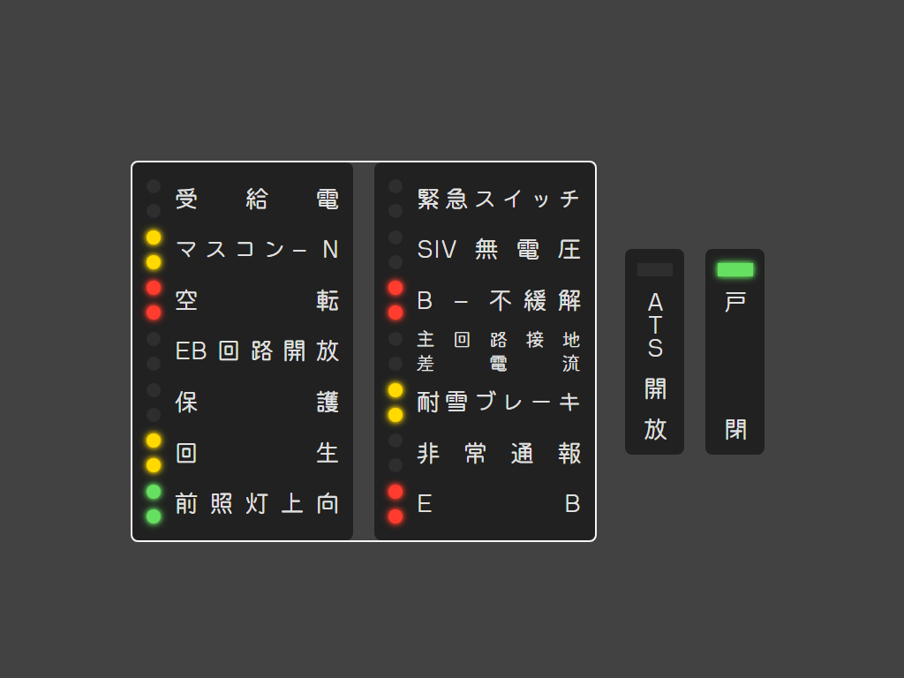
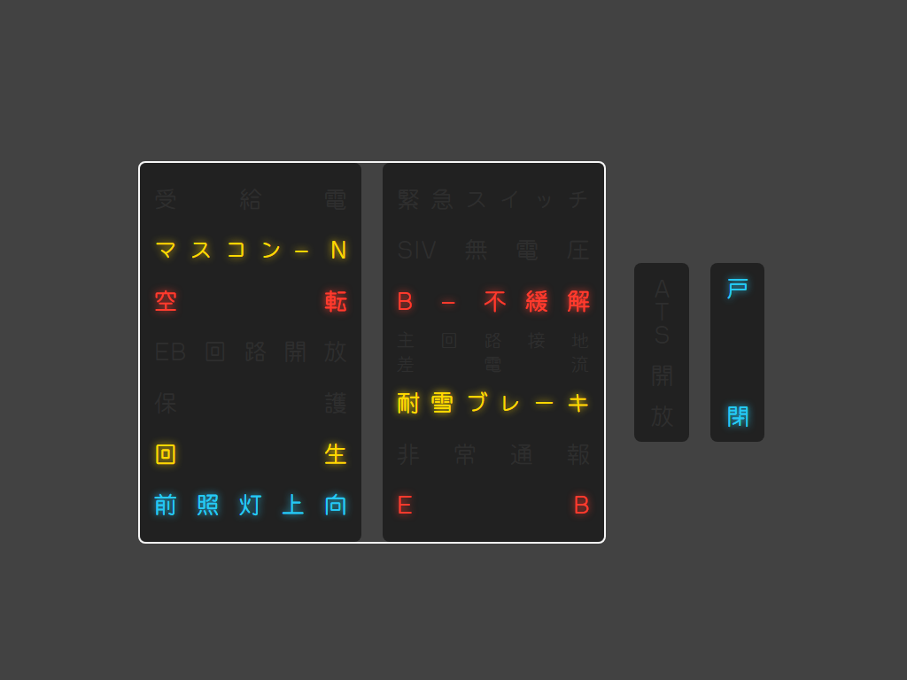

# KK Dentetsu Status Panel (kk-status)

This is a theme that replicates the indicator light panels found on many trains run by KK Corporation.

## Installation

1. Find the theme installation folder using Tanuden Console. (Monitor Launcher > Open themes folder)
2. Download the ZIP file and extract it.
3. Ensure that the folder `@hpgbproductions~kk-status` is produced. When this folder is opened, the file `index.html` should be immediately visible.
4. Copy the `@hpgbproductions~kk-status` folder (not ZIP file) to the theme folder in Step 1.

## Settings

Two style variations are available in the Settings menu at the bottom of the Monitor Launcher in the Tanuden Console. The options are:

| Name | Description |
|:---:|:---|
|表示灯 `shape`|The circular or rectangular lamps next to the text will light up. 
|文字 `text`|The text labels light up. 

## Indicators

Eight indicators on the panel are supported.

| JA | Description |
|:---:|:---|
|マスコン &ndash; N|Mascon (for one-handle trains) or power lever (for two-handle trains) in neutral position|
|空転|Wheel slip\*|
|回生|Regenerative brake|
|前照灯上向|Headlight high beams|
|B &ndash; 不緩解|Brakes are not released when power is applied|
|耐雪ブレーキ|Snowproof brake (only when brakes are off)\*|
|E B|Emergency brake|
|戸閉|All doors closed|

> [!NOTE]
> (\*) This event had to be guessed as it was not supported by the TrainCrew API at the time of development. False positives may be indicated. We apologize for the inconvenience.

> [!WARNING]
> Usage of each indicator differs from that of real-world companies. Please do not send enquiries about this software to any railway companies or manufacturers.

## Developers

[nataniachan (hpgbproductions)](https://x.com/hpgbproductions) - indicator logic and layout planning

[Haruyuki Tanukiji](https://go.tanu.ch/twitter) - layout development and React integration